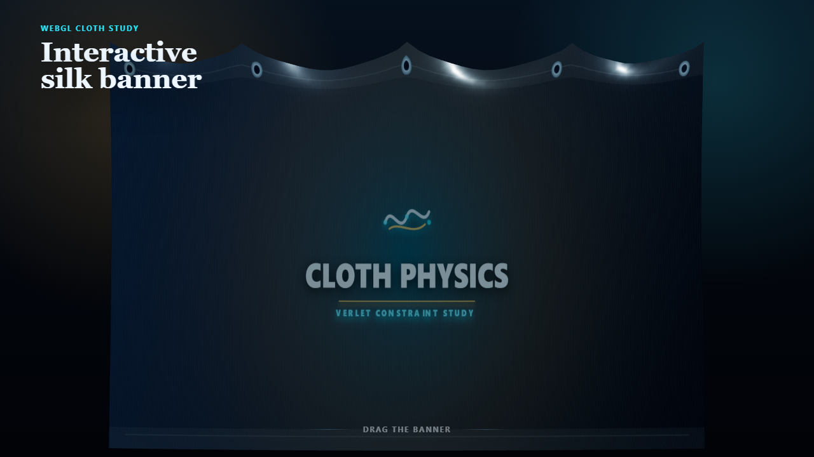

# Cloth Physics Banner

Interactive WebGL cloth study for a branded hero surface. The demo uses a custom particle grid, constraint solver, runtime-generated silk texture, and pointer drag interaction to turn a flat brand banner into a tactile browser object.



[Short drag recording](docs/drag-demo.webm)

## Why It Exists

Most portfolio repos prove data plumbing or framework use. This one proves craft: low-level browser rendering, interaction tuning, and visual polish in a compact, inspectable project.

## What It Shows

- Verlet-style particle integration
- Structural, shear, and bend constraints
- Anchor/grommet profile with sagging cloth spans
- Pointer raycasting and drag-plane interaction
- Dynamic lighting and ambient wind
- Runtime canvas texture generation for silk grain, hems, grommets, procedural mark, and typography

## Run Locally

```bash
npm install
npm run dev
```

Then open the local Vite URL.

## Build

```bash
npm run build
```

## Verification

```bash
npm audit --audit-level=moderate
npm run build
npm run smoke:visual -- http://127.0.0.1:5179/ docs/desktop-smoke.png 1280 720
npm run smoke:visual -- http://127.0.0.1:5179/ docs/mobile-smoke.png 390 844
```

The visual smoke test opens the demo in Chromium, captures a screenshot, and verifies that the cloth scene reports particles, constraints, anchors, a texture, and a nonzero canvas size.

To record a short drag proof:

```bash
npm run record:demo -- http://127.0.0.1:5179/ docs/drag-demo.webm
```

## Project Map

- `src/main.js` - simulation, rendering, interaction, texture generation
- `src/styles.css` - full-viewport presentation layer
- `docs/engineering-notes.md` - implementation notes and boundaries
- `docs/desktop-smoke.png` and `docs/mobile-smoke.png` - browser verification captures

## Framing

This is a focused frontend systems artifact, not a general-purpose physics engine. It is meant to show how a visual idea can be carried through math, rendering, input handling, and tuning until it becomes a polished portfolio interaction.
